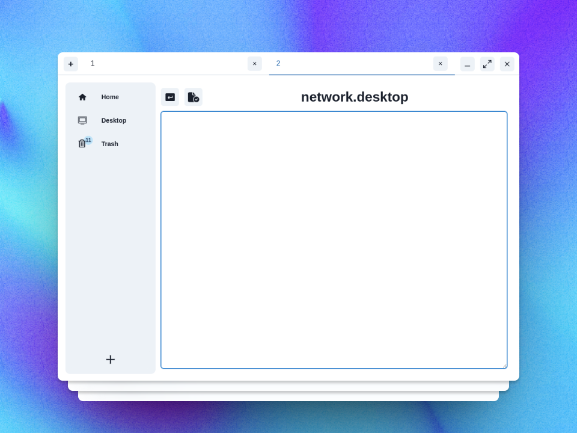

# Aurora Explorer

## About the Project
🚀 Aurora Explorer is a modern and powerful file management tool, built with Electron, ReactTS, and ChakraUI. It provides an intuitive user experience and a sleek user interface.

*Main interface of the Aurora Explorer*

## Features
- 🌟 Modern and responsive user interface with ChakraUI.
- 📁 Efficient file and folder management.
- 🌐 Compatible with various operating systems.
- ⚙️ Easily customizable and extendable.

## Getting Started
1. Clone the repository: `git clone repository_link`
2. Install dependencies: `npm install`
3. Start the application: `npm start`

## Preview
Here is a glimpse of the application in action:

## Contributing
Contributions make the open source community an amazing place to learn, inspire, and create. Any contributions you make are **greatly appreciated**.

## License
Distributed under the MIT License. See `LICENSE` for more information.

## Contact
Suleyman Laarabi - [Aurora Explorer GitHub Link](https://github.com/suleymanlaarabi/Aurora-Explorer)
